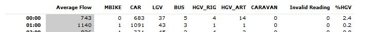

Processing M50 C2 data
================
Dan Brennan
8 February 2017

This note outlines the process and code used to read the M50 PVR data into a database and output aggregated tables and calculation of performance indicators.

``` r
knitr::opts_chunk$set(echo = TRUE)
library(dplyr)
library(tidyr)
library(readr)
library(lubridate)
library(knitr)
```

### Global Variables

Initially global variables are defined including the path to the location where the PVR records are stored, the year required, the route number (in this case 50 for M50) and the TMU site numbers that are required.

A connection is then opened to the SQLite database to store both the raw PVR records and the aggregated tables (change create = FALSE once database is created).

``` r
path <- "/var/datastore/"
year <- 2015
route <- 50
siteNo <- c(1501, 1502, 1503, 1504, 1505, 1506, 1507, 
              1508, 1509, 15010, 15011, 15012)

#db <- src_sqlite(paste(path, "/SQLite/M50.sqlite", sep = ""), create = TRUE)
db <- src_sqlite(paste(path, "/SQLite/M50.sqlite", sep = ""), create = FALSE)
```

### Define Functions

1.  Create calendar with unix epoch values for start and end of month

This is used to split data into monthly subsets in database and filter dates in SQLite before loading into memory for aggregation using R.

``` r
createUnixCal <- function(y) {
  unixCal <- tibble(year = rep(y, 12), month = formatC(1:12, width = 2, flag = "0"), 
                    days = 0, start = 0, end = 0) %>%
  mutate(days = as.character(days_in_month(as.POSIXct(paste(year, month, "01", sep = "-"), 
                                                      format = "%Y-%m-%d"))),
         start = as.POSIXct(paste(year, "-", month, "-", "01", " 00:00:00", sep = "")),
         end = as.POSIXct(paste(year, "-", month, "-", days, " 23:59:59", sep = "")),
         startUnix = unclass(start),
         endUnix = unclass(end))

unixCal <- unixCal %>% 
  select(startUnix, endUnix, month)

}

unix2015 <- createUnixCal(2015)
```

1.  Read PVR flat files into SQLite database

The PVR files for the M50 in 2015 were downloaded from Amazon S3 and temporarily saved to C:/C2 PVR/2015/route-50.

The PVR records are split into 4 flat text files per site. Due to data size, this process is set up to perform ETL procedures on each site and each month over a year. If all sites were processed together, the subsequent aggregation functions would require more memory.

A function is created to point to the above filepath, read in the flat files into memory, loop through each month, apply column names and output to the M50.sqlite database.

``` r
pvr2SQLite <- function(direct, year, routeNo, siteNo) {
    
    setwd(paste(direct, year, "/route-", routeNo, "/site-", siteNo, sep = ""))
    
    files <- c("0000_part_00", "0001_part_00", "0002_part_00", "0003_part_00")
    
    names <- c("siteID", "RecTime", "SubSec", "Flownum", "Direction", 
               "Speed", "Class", "Headway", "Gap", "Length", "GrossWeight", 
               "NumAxles", "ESAL", "Axles", "Weather", "VehicleId", 
               "ClassScheme", "Flag", "BSEQ", "Code", "LegalStatus", 
               "Validity", "ANPRConfidence", "ImagesPresent", "siteID2", "routeNo")
    
    lapply(files, function(i) by(unix2015, 1:nrow(unix2015), function(row) {
        
        a <- read_tsv(i, col_names = names) %>%
          filter(RecTime >= row[1] & RecTime <= row[2]) %>% 
          db_insert_into(con = db$con, 
                         table = paste("pvr", routeNo, siteNo, row[3], year, sep = "_"), 
                         values = .)

        rm(a)
        gc() }))
    
}
```

1.  Data Aggregation

A function to aggregate data into the required periods is developed. This loops through the SQLite database for each site and each month, reads into memory, groups into the period selected, defines new columns and outputs to new SQLite table.

``` r
aggregatePvr <- function(database, siteNo, routeNo, year, 
                         aggregation = c("day", "hour", "min15", "min5"), 
                         month) {
  
  secs <- ifelse(aggregation == "day", 86400,
       ifelse(aggregation == "hour", 3600,
       ifelse(aggregation == "min15", 900,
       ifelse(aggregation == "min5", 300, NA))))
  
  etl <- function(x) {
    s <- tbl(database, 
             paste("pvr", routeNo, siteNo, month, year, sep = "_")) %>% 
      arrange(RecTime) %>% 
      collect(n = Inf) %>%
      select(siteID2, routeNo, RecTime, Code, Direction, 
             Speed, Class, Length) %>% 
      rename(siteID = siteID2) %>% 
      mutate(time = trunc(RecTime / secs) * secs,
             Speed = (Speed / 1000) * 3.6) %>%
      group_by(siteID, time, Class, Code) %>%
      summarise(volume = n(), speed = mean(Speed)) %>% 
      ungroup() %>% 
      db_insert_into(con = db$con, 
                     table = paste(aggregation, route, year, sep = "_"), 
                     values = .)
    
    rm(s)
    gc()
  }

  lapply(month, etl)
}
```

### Load PVR files into SQLite Database

The pvr2SQLite function is used to loop through all M50 sites and load the PVR records into the SQLite database as seperate tables for each site and each month of 2015. This process takes 4-5 hours when used for all sites on the M50 over a year.

``` r
lapply(siteNo, pvr2SQLite, direct = path, year = year, route = 50)
```

The flat files for each site on the M50 in 2015 total range from 3.0 - 5.5 GB per site with all sites totalling 51.3 GB in size. The SQLite database with just the tables of 2015 PVR raw data is approx 39.3 GB in size.

A summary of the structure of a database PVR table is shown below.

``` r
glimpse(tbl(db, "pvr_50_1501_01_2015"))
```

    ## Observations: NA
    ## Variables: 26
    ## $ siteID         <chr> "NRA_000000001501_PVR", "NRA_000000001501_PVR",...
    ## $ RecTime        <dbl> 1422264777, 1422264778, 1422264780, 1422264781,...
    ## $ SubSec         <int> 9, 9, 9, 6, 0, 2, 0, 4, 6, 5, 4, 3, 6, 0, 7, 5,...
    ## $ Flownum        <int> 2, 4, 3, 3, 6, 2, 3, 1, 4, 2, 5, 4, 5, 5, 1, 6,...
    ## $ Direction      <int> 0, 0, 0, 0, 0, 0, 0, 0, 0, 0, 0, 0, 0, 0, 0, 0,...
    ## $ Speed          <int> 24167, 30000, 22778, 22778, 24722, 25278, 28056...
    ## $ Class          <int> 6, 2, 2, 2, 2, 6, 2, 2, 3, 2, 2, 2, 2, 2, 2, 7,...
    ## $ Headway        <int> 6300, 12800, 1690, 1032, 3034, 1760, 1390, 1223...
    ## $ Gap            <int> 6114, 12644, 1316, 524, 2267, 1252, 943, 855, 1...
    ## $ Length         <int> 12700, 4200, 4000, 4400, 4500, 17100, 4600, 420...
    ## $ GrossWeight    <int> 0, 0, 0, 0, 0, 0, 0, 0, 0, 0, 0, 0, 0, 0, 0, 0,...
    ## $ NumAxles       <int> 0, 0, 0, 0, 0, 0, 0, 0, 0, 0, 0, 0, 0, 0, 0, 0,...
    ## $ ESAL           <int> 0, 0, 0, 0, 0, 0, 0, 0, 0, 0, 0, 0, 0, 0, 0, 0,...
    ## $ Axles          <chr> NA, NA, NA, NA, NA, NA, NA, NA, NA, NA, NA, NA,...
    ## $ Weather        <int> 8585216, 8257536, 8716288, 6946816, 9764864, 30...
    ## $ VehicleId      <chr> NA, NA, NA, NA, NA, NA, NA, NA, NA, NA, NA, NA,...
    ## $ ClassScheme    <int> 1024, 1024, 1024, 1024, 1024, 1024, 1024, 1024,...
    ## $ Flag           <int> 0, 0, 0, 0, 0, 0, 0, 0, 0, 0, 0, 0, 0, 0, 0, 0,...
    ## $ BSEQ           <int> 498, 498, 498, 498, 498, 498, 498, 498, 498, 49...
    ## $ Code           <int> 624, 626, 625, 625, 628, 624, 625, 623, 626, 62...
    ## $ LegalStatus    <int> 0, 0, 0, 0, 0, 0, 0, 0, 0, 0, 0, 0, 0, 0, 0, 0,...
    ## $ Validity       <int> 0, 0, 0, 0, 0, 0, 0, 0, 0, 0, 0, 0, 0, 0, 0, 0,...
    ## $ ANPRConfidence <int> 0, 0, 0, 0, 0, 0, 0, 0, 0, 0, 0, 0, 0, 0, 0, 0,...
    ## $ ImagesPresent  <int> 0, 0, 0, 0, 0, 0, 0, 0, 0, 0, 0, 0, 0, 0, 0, 0,...
    ## $ siteID2        <int> 1501, 1501, 1501, 1501, 1501, 1501, 1501, 1501,...
    ## $ routeNo        <int> 50, 50, 50, 50, 50, 50, 50, 50, 50, 50, 50, 50,...

### Output aggregated tables

The aggregatePVR function is used to produce the required aggregated tables for daily, hourly, 15 minute and 5 minute intervals.

``` r
lapply(siteNo, function(x) {
#daily
lapply(unix2015$month, aggregatePvr, 
       database = db, siteNo = x, route = route, year = year, aggregation = "day")
#hourly
lapply(unix2015$month, aggregatePvr, 
       database = db, siteNo = x, route = route, year = year, aggregation = "hour")
#15 min
lapply(unix2015$month, aggregatePvr, 
       database = db, siteNo = x, route = route, year = year, aggregation = "min15")
#5 min
lapply(unix2015$month, aggregatePvr, 
       database = db, siteNo = x, route = route, year = year, aggregation = "min5")
})
```

As a check, the output daily aggregated traffic data was examined for site 1012

``` r
hourly <- tbl(db, "hour_50_2015") %>% 
  filter(siteID == 1501) %>% 
  collect(n = Inf) %>% 
  mutate(time = as.POSIXct(time, origin = "1970-01-01")) %>% 
  arrange(time) %>% 
  group_by(siteID, time, Class) %>% 
  summarise(volume = sum(volume), AvgSpeed = mean(speed)) %>% 
  filter(Class != 0)

hourly %>%
  head(10) %>% 
  kable()
```

|  siteID| time                |  Class|  volume|   AvgSpeed|
|-------:|:--------------------|------:|-------:|----------:|
|    1501| 2015-01-01 00:00:00 |      2|     683|  102.82538|
|    1501| 2015-01-01 00:00:00 |      3|      37|  100.68654|
|    1501| 2015-01-01 00:00:00 |      4|       5|   92.37465|
|    1501| 2015-01-01 00:00:00 |      5|       4|   88.66680|
|    1501| 2015-01-01 00:00:00 |      6|      14|   88.23381|
|    1501| 2015-01-01 01:00:00 |      1|       1|   63.00000|
|    1501| 2015-01-01 01:00:00 |      2|    1091|  101.16970|
|    1501| 2015-01-01 01:00:00 |      3|      43|  103.24433|
|    1501| 2015-01-01 01:00:00 |      4|       3|   96.33240|
|    1501| 2015-01-01 01:00:00 |      5|       1|   90.00000|

This is consistent with data on the [C2 wesbite](https://www.nratrafficdata.ie/c2/tfreport.asp?node=NRA&cosit=000000001012&reportdate=2015-01-01&enddate=2015-01-01&dimtype=2)

------------------------------------------------------------------------



------------------------------------------------------------------------

Similarily daily, 5 and 15 minute aggregated data is consistent with data on C2.

Supplementary Data
------------------

Create a reference table for vehicle classes

``` r
classes <- data_frame(Class = 1:7) %>% 
  mutate(mode = ifelse(Class == 1, "mbike",
                ifelse(Class == 2, "car",
                ifelse(Class == 3, "lgv",
                ifelse(Class == 4, "bus",
                ifelse(Class == 5, "hgvRigid",
                ifelse(Class == 6, "hgvArtic",
                ifelse(Class == 7, "caravan", NA))))))))

classes %>% 
   db_insert_into(con = db$con, table = "classes", values = .)
```

Create a reference table for lane numbers

No lookup table available for all sites. Data gathered on M50 from sample of C2 PVR records.

``` r
read_csv("data/m50laneNum.csv") %>% 
  db_insert_into(con = db$con, table = "m50laneNum", values = .)
```
